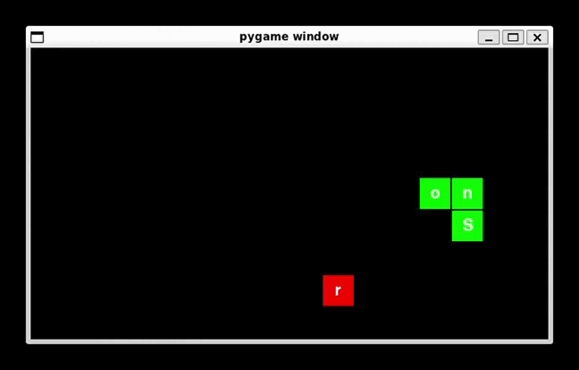

# 🐍 Snord

A classic Snake game with a twist: words are fetched from an API, and you need to collect the letters to form the word.



---

## 🚀 Installation

Clone the repository:
```bash
git clone https://github.com/gtvfn/snord.git
cd snord
```
Create and activate a virtual environment:
```bash
python3 -m venv venv

source venv/bin/activate # for Linux/Mac
venv/Scripts/activate # for Windows
```
Install dependencies:
```bash
pip install -r requirements.txt
```
Run:
```bash
python3 main.py
```

---

## ⚡ Features
- Fetches random words from an API

- Classic Snake gameplay

- Points and scoring system
